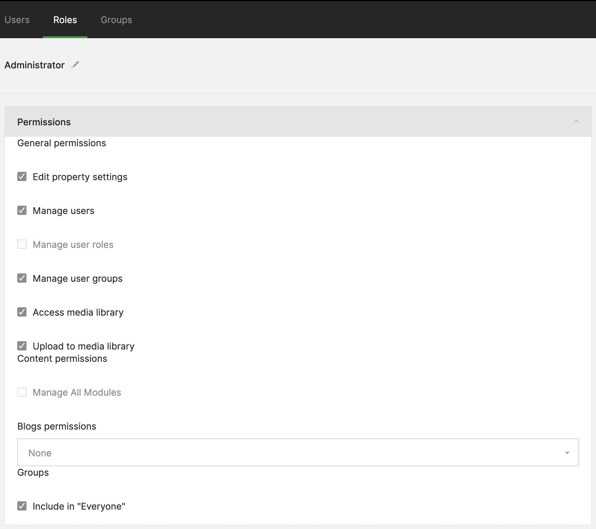
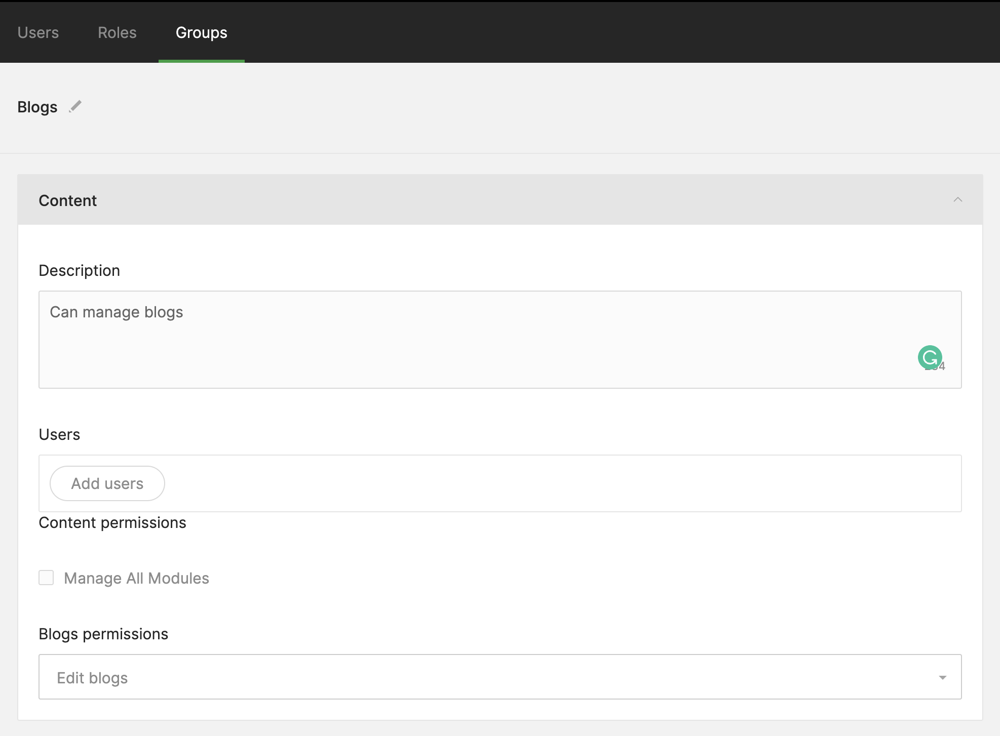
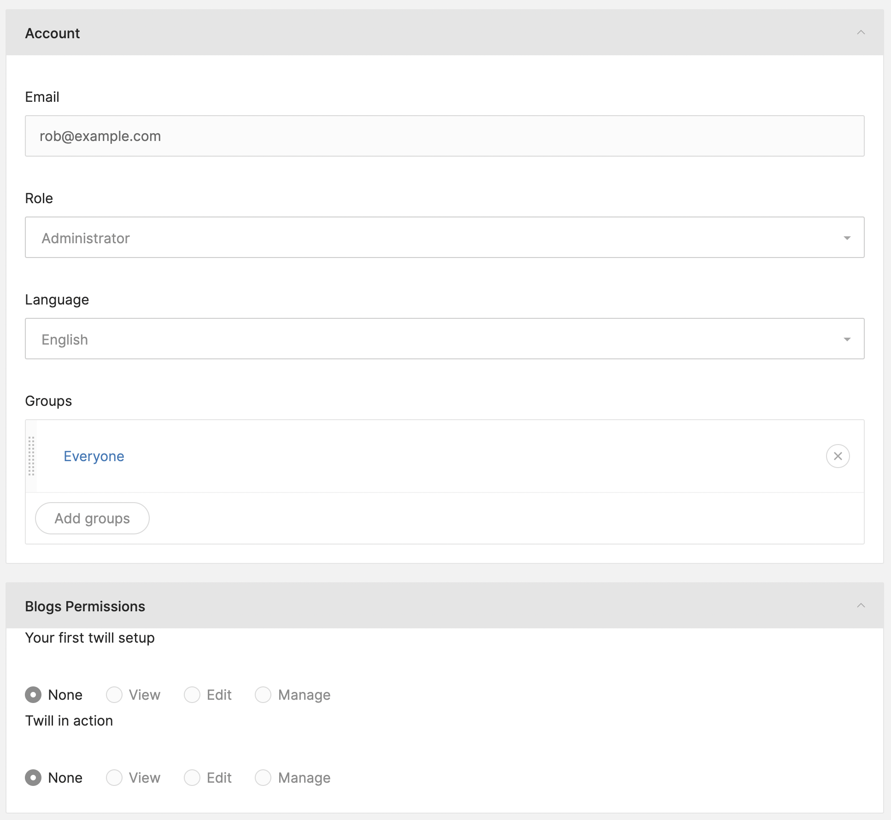

# Advanced permissions

As of Twill 3.x more advanced permissions are now available. These permissions can be setup from code and are managed
via the Twill admin interface.

## Setup

To enable permission management we have to add `permissions-management` to the `twill.enabled` configuration.

`config/twill.php`

```php
<?php

return [
  'enabled' => [
    'permissions-management' => true
  ]
];
```

In addition to this we have to configure the permissions system. There are 3 levels to choose from:

- [**role**](#level-role): this manages the access of modules based on the role of a user
- [**roleGroup**](#level-rolegroup): this manages the access of modules for a group of users, in addition to `role`
- [**roleGroupItem**](#level-rolegroupitem): this manages the permission of items within a module, in addition to `roleGroup`

Set the `twill.permissions.level` to the desired type. And also set the modules to manage in
the `twill.permissions.modules` key.

```php {7-10}
<?php

return [
  'enabled' => [
    'permissions-management'
  ],
  'permissions' => [
      'level' => \A17\Twill\Enums\PermissionLevel::LEVEL_ROLE,
      'modules' => ['blogs'],
  ],
]
```

Once you have setup permission-management, make sure to run your database migrations:

```
php artisan migrate
```

## Level: Role

When using the permission level `role` users will be given a role.

Roles can be managed from the admin interface subnavigation when managing users.

The permission migration seeds 4 roles by default:

- **Owner**: Has permission to do anything on any module, but is not a superadmin.
- **Administrator**: Same as the **Owner** but cannot manage users and must be assigned specific modules it can manage.
- **Team**: Empty role, without permissions by default.
- **Guest**: Empty role, without permissions by default. But not added to the "Everyone" group.

Below is a screenshot of the admin role to illustrate the options you can configure per role:



## Level: RoleGroup

At it's core the RoleGroup level is the same as the Role level, however we now have an additional layer that can be used
to further Group the users.

By default there is only one group "Everyone" where every user belongs to except for "Guests".

You can use Roles in combination with Groups to have more control over the permission a user gets.

You can for example have an administrator, but you still want to let an administrator be in control over a specific module.

Now you can have a group "Module 1" and "Module 2", together with the "administrator" role, each user can only access
the content for their groups.



## Level: RoleGroupItem

With RoleGroupItem you get all of the above. The difference is that you can also set permissions on a per entity level.



