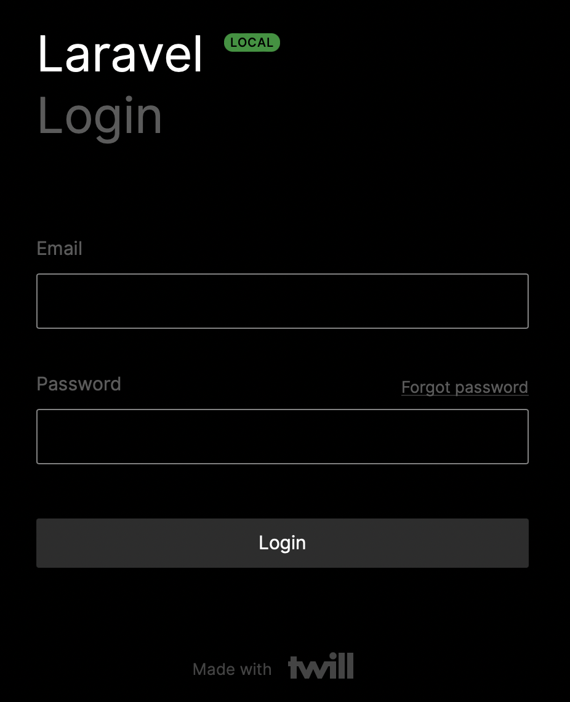

# Installing Twill

Twill is a standard Laravel package, that means, we only have to require it (and set it up) in order to make it work.

So, before we get to the process of building our CMS, let's install Twill.

We can do this using `composer require area17/twill:3.x`.

This will install Twill 3 alongside all other required packages.

## Configuration

With Twill, there are 2 main ways to make your cms available on your site.

### Using a subdomain

The default, which does not require additional configuration is to use a subdomain. Twill will be available using:

`http://admin.YOURDOMAIN.com`, depending on your setup, this will be `http://admin.laravel-twill.test`

### Using a path

Alternatively, or when you cannot use subdomains, you can use a path. To make that work, open up your `.env` file and
add:

```
ADMIN_APP_URL=laravel-twill.test
ADMIN_APP_PATH=admin
```

Where `laravel-twill.test` is your domain.

Once it is setup, you should be able to visit `http://laravel-twill.test/admin`

## Visit our cms

Now that we have configured Twill, let's head over to our cms. Visit the url depending on the configuration you did if
all goes well, you should see a not that well themed login page.


Don't worry, this is expected.

If you get a 404 on the other hand, you should double check the Configuration step we just did and make sure there are
no typo's.

## Finish the installation

As we ended our last step with an non-themed login screen. Let's go ahead and fix that.

Twill's user interface is made in Vue. Every release comes with a pre-compiled set of Javascript and CSS. But before
these can work we have to publish them.

In addition to that, we need to migrate our database and create a super administrator so that we can login as well.

We have created a command to do all that, so let's open up the terminal and run:

`php artisan twill:install`

As you can see from the output, it:

- Prepares and migrates the database
- Publishes the twill.php and translatable.php configuration files
- Publishes the assets
- Prompts you to create a super admin

Once you have filled everything in, we can refresh our browser. We now see a proper login screen:

<!-- <div class="max-w-lg mx-auto"></div> -->


**Congratulations, you have successfully installed Twill!**

You can now login with the super admin account your created, now let's start building our CMS!
