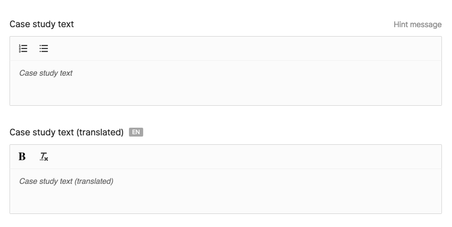

# WYSIWYG



Form view:
```html
<x-twill::wysiwyg 
    name="case_study" 
    :label="twillTrans('Case study text')"
    :toolbar-options="['list-ordered', 'list-unordered']" 
    :placeholder="twillTrans('Case study placeholder')"
    :maxlength="200" 
    :note="twillTrans('Help text')"
/>

<x-twill::wysiwyg 
    name="case_study" 
    :label="twillTrans('Case study text')"
    :toolbar-options="[ [ 'header' => [1, 2, false] ], 'list-ordered', 'list-unordered', [ 'indent' => '-1'], [ 'indent' => '+1' ] ]" 
    :placeholder="twillTrans('Case study placeholder')"
    :edit-source="true"
    :translated="true"
    :maxlength="200" 
    :note="twillTrans('Help text')"
/>
```

Form builder:
```php
Wysiwyg::make()
    ->name('case_study')
    ->toolbarOptions(['list-ordered', 'list-unordered'])
    ->maxLength(200)
    ->note('Some note')
```

::: details Old method
```php
@formField('wysiwyg', [
    'name' => 'case_study',
    'label' => 'Case study text',
    'toolbarOptions' => ['list-ordered', 'list-unordered'],
    'placeholder' => 'Case study text',
    'maxlength' => 200,
    'note' => 'Hint message',
])

@formField('wysiwyg', [
    'name' => 'case_study',
    'label' => 'Case study text',
    'toolbarOptions' => [ [ 'header' => [1, 2, false] ], 'list-ordered', 'list-unordered', [ 'indent' => '-1'], [ 'indent' => '+1' ] ],
    'placeholder' => 'Case study text',
    'maxlength' => 200,
    'editSource' => true,
    'note' => 'Hint message',
])
```
:::

By default, the WYSIWYG field is based on [Quill](https://quilljs.com/).

You can add all [toolbar options](https://quilljs.com/docs/modules/toolbar/) from Quill with the `toolbarOptions` key.

For example, this configuration will render a `wysiwyg` field with almost all features from Quill and Snow theme.

```php
@php
$wysiwygOptions = [
  ['header' => [2, 3, 4, 5, 6, false]],
  'bold',
  'italic',
  'underline',
  'strike',
  ["script" => "super"],
  ["script" => "sub"],
  "blockquote",
  "code-block",
  ['list' => 'ordered'],
  ['list' => 'bullet'],
  ['indent' => '-1'],
  ['indent' => '+1'],
  ["align" => []],
  ["direction" => "rtl"],
  'link',
  "clean",
];
@endphp

<x-twill::wysiwyg 
    name="case_study" 
    :label="twillTrans('Case study text')"
    :toolbar-options="$wysiwygOptions"
    :placeholder="twillTrans('Case study placeholder')"
    :edit-source="true"
    :maxlength="200" 
    :note="twillTrans('Help text')"
/>
```

::: details Old method
```php
 @formField('wysiwyg', [
    'name' => 'case_study',
    'label' => 'Case study text',
    'toolbarOptions' => [
      ['header' => [2, 3, 4, 5, 6, false]],
      'bold',
      'italic',
      'underline',
      'strike',
      ["script" => "super"],
      ["script" => "sub"],
      "blockquote",
      "code-block",
      ['list' => 'ordered'],
      ['list' => 'bullet'],
      ['indent' => '-1'],
      ['indent' => '+1'],
      ["align" => []],
      ["direction" => "rtl"],
      'link',
      "clean",
    ],
    'placeholder' => 'Case study text',
    'maxlength' => 200,
    'editSource' => true,
    'note' => 'Hint message`',
 ])
```
:::

Note that Quill outputs CSS classes in the HTML for certain toolbar modules (indent, font, align, etc.), and that the image module is not integrated with Twill's media library. It outputs the base64 representation of the uploaded image. It is not a recommended way of using and storing images, prefer using one or multiple `medias` form fields or blocks fields for flexible content. This will give you greater control over your frontend output.

| Option         | Description                                                                                                              | Type/values                                                | Default value                           |
|:---------------|:-------------------------------------------------------------------------------------------------------------------------|:-----------------------------------------------------------|:----------------------------------------|
| name           | Name of the field                                                                                                        | string                                                     |                                         |
| label          | Label of the field                                                                                                       | string                                                     |                                         |
| type           | Type of wysiwyg field                                                                                                    | quill<br/>tiptap                                           | quill                                   |
| toolbarOptions | Array of options/tools that will be displayed in the editor                                                              | [Quill options](https://quilljs.com/docs/modules/toolbar/) | bold<br/>italic<br />underline<br/>link |
| editSource     | Displays a button to view source code                                                                                    | true<br />false                                            | false                                   |
| hideCounter    | Hide the character counter displayed at the bottom                                                                       | true<br />false                                            | false                                   |
| limitHeight    | Limit the editor height from growing beyond the viewport                                                                 | true<br />false                                            | false                                   |
| translated     | Defines if the field is translatable                                                                                     | true<br/>false                                             | false                                   |
| maxlength      | Max character count of the field                                                                                         | integer                                                    | 255                                     |
| note           | Hint message displayed above the field                                                                                   | string                                                     |                                         |
| placeholder    | Text displayed as a placeholder in the field                                                                             | string                                                     |                                         |
| required       | Displays an indicator that this field is required<br/>A backend validation rule is required to prevent users from saving | true<br/>false                                             | false                                   |


A migration to save a `wysiwyg` field would be:

```php
Schema::table('articles', function (Blueprint $table) {
    ...
    $table->text('case_study')->nullable();
    ...

});
// OR
Schema::table('article_translations', function (Blueprint $table) {
    ...
    $table->text('case_study')->nullable();
    ...
});
```
When used in a [block](/block-editor/creating-a-block-editor.html), no migration is needed.
